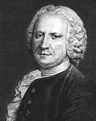

# Chapter 5

# Titrations Based on Acid-base Reactions

Acid-base titration, which is also known as acid-base neutralization titration in some textbook, has a rich history that traces back to the early experiments in quantitative analysis and the development of acid-base theories. In late 1700s to early 1800s, French chemist François Antoine Henri Descroizilles (德克劳西) developed the first burette-like device in 1791, which was a significant step towards quantitative chemical analysis. Later, Joseph Louis Gay-Lussac, another French chemist, improved upon this design, leading to more accurate and standardized titration procedures.

---

François Antoine Henri Descroizilles

---

In the mid-19th century, German chemist Karl Friedrich Mohr developed the modern burette with a glass stopcock. This equipment can allowed for more precise control of liquid flow during titration, which significantly improved the accuracy of titration. And the process of titration was further refined with the introduction of standard solutions.

In 1887, Swedish chemist Svante Arrhenius proposed the acid-base ionization theory to describe the acid-base reaction, which laid the groundwork for understanding the chemical reactions in acid-base titration. Later, in the early 20th century, Johannes Nicolaus Brønsted and Thomas Martin Lowry independently developed the Brønsted-Lowry theory, which expanded the definitions of acids and bases beyond those proposed by Arrhenius. It must be noted that Brønsted-Lowry theory contains excellent philosophical ideas that are helpful for understanding the essence of acids and bases. In 1996, American chemist Robert de Levie developed a general expression for acid-base titration, in which the Brønsted-Lowry theory is the key foundation. And de Levie's work marked the establishment of a mathematical theory for acid-base titration. Undoubtedly, the Brønsted-Lowry theory is a milestone. 

In 1909, Søren Sørensen introduced the concept of pH. This concept allowed for a more precise understanding of acid-base equilibrium, which is crucial in the calculation of the pH value at the equivalence point. The use of pH indicators, substances that change color at a specific pH level, became an essential part in the estimating of the equivalence point. Later, pH meter, an electronic device to measure the pH value, was applied to acid-base titration too. It is not an exaggeration to say that the concept of pH was another milestone. 

Throughout the 20th century, there were significant advancements in instrumentation and techniques. The development of potentiometric titration, for example, allowed for more precise endpoint detection using electrodes instead of relying solely on visual indicators.

With the advent of computers and automation, titration methods have become more sophisticated and precise. Automated titration systems, which can control titrant addition and measure pH or other properties automatically, have become standard in many analytical laboratories. 

Acid-base titration has evolved significantly from its early rudimentary forms to the highly precise and automated processes used today. This evolution mirrors the broader development of chemistry theory and technology, from basic qualitative observations to a highly quantitative and sophisticated science. Now, artificial intelligence has developed to a very high level and has penetrated into various fields of modern society. It is only a matter of time before artificial intelligence enters the field of acid-base titration. We will present an example in this chapter.

---

## 5.1 Brønsted-Lowry theory of acid and base

The Brønsted-Lowry theory defines acids and bases in terms of their ability to donate or accept protons ($\mathrm{H^{+}}$ ions). According to the theory, an acid is a substance that can donate a proton to another substance, while a base is a substance that can accept a proton. This definition yields an interesting result: when an acid donates a proton, it becomes a base, which in turn has a tendency to accept a proton and become the original acid. Similar situation also occurs with bases. In order to make this definition self consistent, they introduced the concept of conjugate acid-base pairs. When an acid donates a proton, it becomes a base, known as the conjugate base of the original acid. Similarly, when a base accepts a proton, it becomes an acid, known as the conjugate acid of the original base. For example, in aqueous solution of acetic acid, there exists the following equilibrium:

$$
\underset{\mathrm{acid}}{\mathrm{CH_3COOH}}\mathrm{(aq)} ~~+~~ 
\underset{\mathrm{base}}{\mathrm{H_2O}}\mathrm{(l)}  
~~=~~ 
\underset{\mathrm{conjugate~base}}{\mathrm{CH_3COO^{-} }}\mathrm{(aq)} ~~+~~ 
\underset{\mathrm{conjugate~acid}}{\mathrm{H_3O^{+} }} \mathrm{(aq)}
$$

Here, acetic acid and acetate ion are a conjugate acid-base pair. General expression is as follows:

The theory is very perfect because there can be no more logical and practical contradictions as the acid-base ionization theory. Meanwhile, it also raises an interesting question: what would happen if the positions of the acids and bases in the definition were swapped? For example, I now define acid as a substance that can accept proton(s); base is the one that can donate proton(s). And keeping the concept of the conjugate acid-base pairs. Is this acid-base definition still valid? The fact is, this definition still holds! This fact indicates that the concepts of acid and base themselves are artificially defined. And the most crucial part is accepting or donating protons. The introduction of concepts by conjugated acids and bases actually seems to be understood within the philosophical framework of dialectical materialism, that is, acids and bases are dialectical unity. If we accept this philosophy, we only need to define the concept of acid, because base is a conjugate of acid therefore it is always accompanied by acid. It looks a bit like a scenario of quantum entanglement, doesn't it? You will see that if you accept this philosophy, the subsequent content will be very natural.

---

## 5.2 Acid dissociation constant

The ability of acid to provide protons is characterized by the acid dissociation constant. This constant is essentially the equilibrium constant at which acid dissociation reaches equilibrium. When an acid $\mathrm{HB}$ is dissolved in water, following equilibrium will be reached:

$$
\mathrm{HB(aq) + H_2O(l) ~~=~~ B^{-}(aq) + H_{3}O^{+}(aq)   }
$$

The equilibrium constant can be expressed as follows:

$$
K^{\circleddash}(\mathrm{HB}) = \frac{\frac{[\mathrm{B^{-} }]}{c^{\circleddash}} 
\frac{[\mathrm{H_{3}O^{+}}]}{c^{\circleddash}}  }
{\frac{[\mathrm{HB}]}{c^{\circleddash}}
\frac{[\mathrm{H_2O}]}{c^{\circleddash}}    }  \tag{5.1}
$$

where, $K^{\circleddash}$ is standard equilibrium constant; square brackets [] denote equilibrium concentration of the species contained within them; $c^{\circleddash} = 1~\text{mol/L}$.

Equation (5.1) contains the equilibrium concentration of water. Calculation results show that the concentration of water is about $55.60~\text{mol/L}$ so it can be taken as a constant. Thus, we get a simplified expression as following:

$$
K_{\text{a}}(\mathrm{HB}) = 
K^{\circleddash}(\mathrm{HB}) \times{} \frac{[\mathrm{H_2O}]}{c^{\circleddash}} 
= \frac{\frac{[\mathrm{B^{-} }]}{c^{\circleddash}} 
\frac{[\mathrm{H_{3}O^{+}}]}{c^{\circleddash}}  }
{\frac{[\mathrm{HB}]}{c^{\circleddash}}
  } 
=\frac{\frac{[\mathrm{B^{-} }]}{c^{\circleddash}} 
\frac{[\mathrm{H^{+}}]}{c^{\circleddash}}  }
{\frac{[\mathrm{HB}]}{c^{\circleddash}}
  } \tag{5.2}
$$

here, $K_{\text{a}}(\mathrm{HB})$ is called **the acid dissociation constant** of $\mathrm{HB}$. And, we also simplify the expression of $[\mathrm{H_{3}O^{+}}]$ to $[\mathrm{H^{+}}]$ as a convention of this e-book. Although it is not the reality, it will not lead to misunderstanding for people in the field of chemistry. 

From equation (5.2), one can see that the bigger is the $K_{\text{a}}(\mathrm{HB})$ value, the more $\mathrm{H^{+}}$ is dissociated, and the stronger is the acid $\mathrm{HB}$. Note that the acid dissociation constant is a solvent dependent quantity, and the same acid has different acids in different solvents. If not specified, the acid dissociation constants refer to those in aqueous solutions.

The reverse process of  $\mathrm{B^{-}}$ can be described in following:

$$
\mathrm{B^{-}(aq)} + \mathrm{H_{2}O(l) }
~~=~~
\mathrm{HB(aq)}  + \mathrm{OH^{-}(aq)} 
$$

In history, scientists have created the following parameter:

$$
K_{\text{b} }(\mathrm{B^{-}}) = 
\frac{\frac{[\mathrm{HB }]}{c^{\circleddash}} 
\frac{[\mathrm{OH^{-}}]}{c^{\circleddash}}  }
{\frac{[\mathrm{B^{-}}]}{c^{\circleddash}}
  } \tag{5.2}
$$

and called it the **base dissociation constant** of $\mathrm{B^{-}}$. It is pretty weird because the $\mathrm{B^{-}}$ dissociates nothing! If we must give it a terminology, I suggest it be the **base association constant**. A more important result is that by multiplying equation (5.1) and (5.2), we get:

$$
K_{\text{a}}(\mathrm{HB}) \times{} K_{\text{b} }(\mathrm{B^{-}}) 
=\frac{\frac{[\mathrm{B^{-} }]}{c^{\circleddash}} 
\frac{[\mathrm{H^{+}}]}{c^{\circleddash}}  }
{\frac{[\mathrm{HB}]}{c^{\circleddash}}
  } \times{} 
\frac{\frac{[\mathrm{HB }]}{c^{\circleddash}} 
\frac{[\mathrm{OH^{-}}]}{c^{\circleddash}}  }
{\frac{[\mathrm{B^{-}}]}{c^{\circleddash}}
  } 
= \frac{[\mathrm{H^{+}}]}{c^{\circleddash}} \times{}  
\frac{[\mathrm{OH^{-}}]}{c^{\circleddash}} 
= K_{\text{w}} \tag{5.4}
$$

where, $K_{\text{w}}=1\times{}10^{-14}$ is the **ion-product constant for water**.  

Equation (5.4) tells us an extremely important reality that there is no need to define the base dissociation (or association) constant $K_{\text{b}}(\mathrm{B^{-}})$ because it can be calculated from $K_{\text{a}}(\mathrm{HB})$. Now, let's take a ultimate leap: do we need to define acid and base in the meantime? Can we just only define acid? Before we get the answers, let us go to a special case: the dissociation of hydrochloric acid in water. Following is the equilibrium equation:

$$
\mathrm{ HCl(aq) } + \mathrm{H_2O(l) } 
~~= ~~
\mathrm{Cl^{-}(aq)} + \mathrm{H_{3}O^{+}(aq)} 
$$

here, we use $\xrightleftharpoons{}$ arrow to describe the dissociation of hydrochloric acid. However, as we know, hydrochloric acid will totally dissociated in water. It means that there is no $\mathrm{HCl}$ molecule in water theoretically. Thus, we get

$$
K_{\text{a}}(\text{HCl}) = \frac{\frac{[\mathrm{Cl^{-} }]}{c^{\circleddash}} 
\frac{[\mathrm{H^{+}}]}{c^{\circleddash}}  }
{\frac{[\mathrm{HCl}]}{c^{\circleddash}}} 
= \frac{\frac{[\mathrm{Cl^{-} }]}{c^{\circleddash}} 
\frac{[\mathrm{H^{+}}]}{c^{\circleddash}}  }
{\frac{0}{c^{\circleddash}}} = \infty
$$

Chemically, this result is reasonable. Now, we go to another special case: the dissociation of sodium hydroxide in water. Following is the equilibrium equation:

$$
\mathrm{NaOH(aq)} + \mathrm{H_2O(l) } ~~=~~\mathrm{OH^{-}(aq)} + \mathrm{Na^{+}(aq)} +  \mathrm{H_2O(l) }
$$

Thus,

$$
\mathrm{NaOH(aq)} ~~=~~\mathrm{OH^{-}(aq)} + \mathrm{Na^{+}(aq)} 
$$

We get:

$$
K_{\text{b} }(\mathrm{NaOH}) = \frac{ \frac{[\mathrm{OH^{-}}]}{c^{\circleddash} } \times{} \frac{[\mathrm{Na^{+}}]}{c^{\circleddash} }    }{ \frac{ [\mathrm{NaOH} ] }{ c^{\circleddash} }  } = \frac{ \frac{[\mathrm{OH^{-}}]}{c^{\circleddash} } \times{} \frac{[\mathrm{Na^{+}}]}{c^{\circleddash} }    }{ \frac{ 0}{ c^{\circleddash} }  } = \infty
$$

Logically, this result is also reasonable. Now, if we define $K_{\text{a} }(\mathrm{NaOH})$, and let 

$$
K_{\text{a} }(\mathrm{NaOH}) = \frac{1}{K_{\text{b} }(\mathrm{NaOH})} = 0
$$

Is it still reasonable? Sure, it is still reasonable both mathematically and chemically. The reason is that sodium hydroxide will never dissociate a proton!

Thus, defining all substances as acids is feasible. And all we need to do is to retain the acid dissociation constant and to abandon the base association constant. In some special situation, such as the sodium hydroxide, we can "create" a reasonable acid dissociation constant. Believe it or not, if you understand what I am talking about, you will be free in learning this chapter. We can still use the terminologies of acid and base if we want to treat them as opposites.    

---

## 5.3 Distributions of species in acid and base system

## 5.4 Calculation the concentration of hydrogen ion

## 5.5 Buffer solution of acid and base

## 5.6 Mathematical expressions of acid-base titration

---

## 5.7 Determination of Titration Endpoint and Titration Error

## 5.8 Typical applications

### 5.8.1 Measuring of nitrogen in organic

### 5.8.2 Measuring of nitrogen in ammonium salts

## 5.9 The Influence of Carbon Dioxide

---
